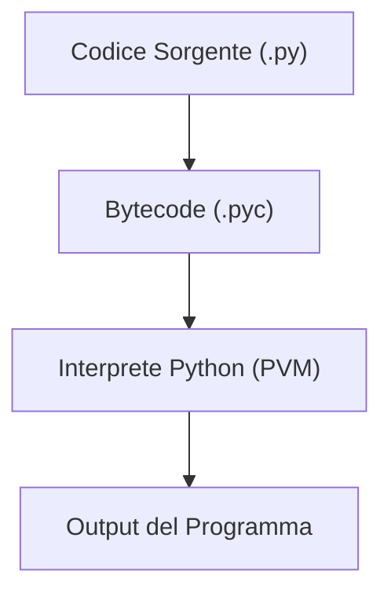
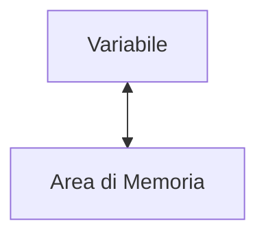
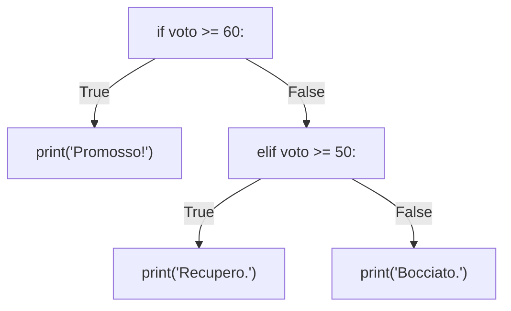

# Guida Python

##### di Francesco Giuseppe Gillio  
###### I.I.S. G. Cena di Ivrea

### Ambiente di Sviluppo Integrato (IDE) del Corso

- [mark-one](https://mark-one.streamlit.app)

---

## Indice

1. [Introduzione a Python](#introduzione-a-python)  
2. [Variabili in Python](#variabili-in-python)  
3. [Operatori in Python](#operatori-in-python)
4. [Numeri in Python](#numeri-in-python)
5. [Stringhe in Python](#stringhe-in-python)
6. [Tuple in Python](#tuple-in-python)
7. [Liste e Set in Python](#liste-e-set-in-python)
8. [Dizionari in Python](#dizionari-in-python)
9. [Istruzioni Condizionali](#istruzioni-condizionali)
10. [Cicli Iterativi](#cicli-iterativi)
11. [Funzioni in Python](#funzioni-in-python)

---

## Introduzione a Python

*Che cos'è un linguaggio di programmazione?* Un **linguaggio di programmazione** è un sistema di simboli e regole sintattiche per formulare istruzioni eseguibili da un elaboratore elettronico (*computer*). La funzione principale di un linguaggio di programmazione è tradurre pensieri astratti in operazioni computabili per risolvere problemi complessi, automatizzare processi o elaborare dati.

Tra i numerosi linguaggi di programmazione, **Python**, sviluppato negli anni '90 da **Guido van Rossum**, si distingue per la sua potenza espressiva e versatilità. Grazie a una sintassi lineare e leggibile, unita a un ampio ecosistema di librerie per il calcolo scientifico, l'apprendimento automatico e lo sviluppo software, Python rappresenta lo stato dell'arte nel panorama della programmazione scientifica, alla base di realtà come la NASA, Google, Netflix, ecc.

Un esempio di codice Python:

```python
# Programma che stampa "Hello, World!" sulla console
print("Hello, World!")
```

### Il Processo di Esecuzione del Codice in Python

Quando si scrive un programma in Python, il computer non è in grado di interpretare direttamente il codice sorgente scritto dall'utente. Affinché il codice sia eseguibile, Python esegue un processo a tre fasi:

1. **Sorgente** (`file.py`):
   - Il codice sorgente è scritto in un file con estensione `.py`. Questo file contiene le istruzioni secondo la sintassi del linguaggio Python, leggibile e comprensibile dall'utente.

2. **Bytecode** (`file.pyc`):
   - Al momento dell'esecuzione, Python traduce il codice sorgente in una rappresentazione intermedia chiamata *bytecode*.

3. **Runtime** (`PVM`):
   - La *Python Virtual Machine* (PVM) interpreta e traduce ciascuna istruzione del bytecode in comandi eseguibili dal sistema operativo. Questo consente l'esecuzione del programma.

In sintesi, Python traduce il codice sorgente – la sequenza di istruzioni scritte dall'utente per la macchina – in un formato eseguibile dall'hardware.



---

## Variabili in Python

Nel contesto dell'informatica, una **variabile** è un'entità astratta che associa un *identificatore* a un'*area di memoria* nel computer. In altre parole, la variabile non è altro che un *riferimento* a un valore in memoria.



### Le Variabili

In Python, grazie al meccanismo di *tipizzazione dinamica*, le variabili non richiedono una dichiarazione esplicita del tipo, né una definizione pre-allocata della memoria. Per dichiarare una variabile si assegna un valore a un identificativo tramite l'operatore di assegnamento (`=`).

```python
numero = 10
stringa = "Python"
lista = [1, 2, 3]
```

In questo esempio, `numero` si riferisce al valore intero (`int`) `10`, `stringa` al valore di tipo stringa (`str`) `"Python"`, e `lista` al valore di tipo lista (`list`) `[1, 2, 3]`. L’assegnamento stabilisce un riferimento (*binding dinamico*) tra l'identificatore e il valore.

```python
base = 10
altezza = 5
area = base * altezza
print("L'area del rettangolo è: ", area)  # L'area del rettangolo è: 50
```

In questo esempio, le variabili `base` e `altezza` servono da parametri di ingresso per l’elaborazione della variabile `area`.

```python
x = 10
x = 20
```

In questo esempio, quando assegniamo il valore `20` a `x`, la variabile non sovrascrive il valore precedentemente referenziato (`10`), ma smette di "riferirsi" all'oggetto `10` e inizia a "riferirsi" all'oggetto `20`. Python gestisce automaticamente la memoria tramite il **garbage collector**, che rimuove gli oggetti non referenziati, come l'intero `10` all'esecuzione della seconda riga di codice (`x = 20`).

### Tipi di Dato in Python

La tabella sottostante riassume i principali **tipi di dato** in Python, dai tipi primari, come numeri interi e stringhe, ai tipi complessi, come liste, dizionari e set:

| Tipo di Dato  | Nome       | Descrizione                           | Esempi                                      |
|---------------|------------|---------------------------------------|--------------------------------------------|
| Intero        | `int`      | Numeri interi di dimensione arbitraria| `-42`, `0`, `1200`, `9999999999`           |
| Reale         | `float`    | Numeri a virgola mobile               | `3.14`, `1.23e-10`, `4.0E210`              |
| Booleano      | `bool`     | Valori booleani (vero o falso)        | `True`, `False`                            |
| Complesso     | `complex`  | Numeri complessi                     | `3+4j`, `5.0+4.1j`, `3j`                   |
| Stringhe      | `str`      | Testo rappresentato come stringa      | `''`, `'Python'`, `"programmazione"`       |
| Bytes         | `bytes`    | Rappresentazione di sequenze di byte | `b''`, `b'\x00\x01\x02'`, `b'Python'`      |
| Liste         | `list`     | Sequenze ordinate e mutabili          | `[]`, `[1, 2, 3]`, `['Python', 'script']`  |
| Tuple         | `tuple`    | Sequenze ordinate e immutabili        | `()`, `(1, 2, 3)`, `('Python', 3)`         |
| Set           | `set`      | Insiemi di oggetti unici             | `{1, 2, 3}`, `{'a', 'b'}`                  |
| Dizionari     | `dict`     | Associazioni chiave-valore            | `{}`, `{'nome': 'Francesco', 'età': 20}`   |

### Nomi delle Variabili

La scelta dei nomi per le variabili segue un insieme di regole e convenzioni sintattiche. Un nome di variabile inizia con una lettera o con il carattere underscore (`_`), seguito da lettere, numeri o underscore. Inoltre, è importante evitare parole riservate (*keyword*), come `False`, `None`, `True`, `and`, `as`, `assert`, `break`, `class`, `continue`, `def`, `del`, `elif`, `else`, `except`, `for`, `from`, `if`, `import`, `in`, `is`, `not`, `or`, `pass`, `return`, `try`, `while`, `with`, ecc.

---

## Operatori in Python

Il linguaggio Python, nella sua essenza, supporta una serie di **operatori numerici e logici** per l'esecuzione di operazioni aritmetiche, di confronto e manipolazioni bitwise su diversi tipi di dati, tra cui interi, numeri reali, stringhe, e altri tipi complessi.

### Operatori Aritmetici

Python supporta una serie di **operatori aritmetici** per l'esecuzione di operazioni matematiche di base, come addizione, sottrazione e divisione.

| Operatore | Descrizione                     | Esempi                      |
|-----------|---------------------------------|-----------------------------|
| `+`       | Addizione                       | `10 + 12` → `22`            |
| `-`       | Sottrazione                     | `5 - 1` → `4`              |
| `*`       | Moltiplicazione                 | `10 * 12` → `120`          |
| `/`       | Divisione (float)               | `9 / 4` → `2.25`           |
| `//`      | Divisione intera                | `9 // 4` → `2`             |
| `%`       | Modulo (resto della divisione)  | `9 % 4` → `1`              |

### Operatori di Confronto

Python supporta anche una serie di **operatori di confronto** per la valutazione di relazioni tra valori. Questi operatori restituiscono un valore booleano (`True` o `False`).

| Operatore | Descrizione            | Esempi                     |
|-----------|------------------------|----------------------------|
| `==`        | uguale a               | `8 == 8` → `True`          |
|           |                        | `3 == 5` → `False`             |
| `!=`        | diverso da              | `3 != 5` → `True`            |
|           |                        | `8 != 8` → `False`             |
| `<`         | minore di              | `3 < 5` → `True`               |
|           |                        | `5 < 3` → `False`              |
| `<=`        | minore o uguale a      | `3 <= 5` → `True`              |
|           |                        | `8 <= 8` → `True`              |
| `>`         | maggiore di            | `5 > 3` → `True`               |
|           |                        | `3 > 5` → `False`              |
| `>=`        | maggiore o uguale a    | `5 >= 3` → `True`              |
|           |                        | `8 >= 8` → `True`              |

Gli operatori di confronto servono all'interno di strutture condizionali o cicli per determinare il flusso di esecuzione in base ai valori confrontati.

### Operatori Logici (Booleani)

Python supporta i tre principali **operatori logici**: `and`, `or`, e `not`. Questi operatori, come gli operatori di confronto, servono per la costruzione di espressioni condizionali, qualora sia necessario verificare più condizioni.

| Operatore | Descrizione                                                       |
|-----------|-------------------------------------------------------------------|
| `and`       | Ritorna `True` se entrambi gli operandi sono *veri*, altrimenti `False` |
| `or`        | Ritorna `True` se almeno uno degli operandi è *vero*, altrimenti `False`|
| `not`       | Ritorna `False` se l'operando è *vero*, `True` se l'operando è *falso*    |

---

## Numeri in Python

Python supporta quattro categorie distintive di dati numerici: 

- Interi (`int`)
- Reali (`float`)
- Complessi (`complex`)
- Booleani (`bool`)

Per dichiarare un numero si assegna un valore numerico a un identificativo con l'operatore di assegnamento (`=`).

```python
intero = 10  # int
decimale = 3.14  # float
```

Python gestisce automaticamente la precisione dei numeri in virgola mobile e la loro locazione in memoria.

### Conversione tra Tipi Numerici

Python supporta la conversione tra tipi numerici, ad esempio da interi (`int`) a decimali (`float`) e viceversa, tramite funzioni built-in.

```python
intero = 5
decimale = float(intero)  # 5.0

decimale = 3.14
intero = int(decimale)  # 3
```

---

## Stringhe in Python

In Python, una **stringa** (`str`) non è che una sequenza ordinata e immutabile di caratteri. Per dichiarare una stringa si assegna un valore con apici singoli `'testo'`, o apici doppi `"testo"`, a un identificativo con l'operatore di assegnamento (`=`).

```python
messaggio = "Benvenuti nel corso di Python!"
nome = 'Batman'
```

Le stringhe supportano numerose operazioni, come *concatenazione* e *slicing* (selezione di sottostringhe).

### Concatenazione e Ripetizione

Le stringhe si concatenano con l'operatore `+` e si ripetono con l'operatore `*`.

```python
saluto = "Ciao, " + "come stai?"
print(saluto)  # Ciao, come stai?

ripeti = "Python! " * 3
print(ripeti)  # Python! Python! Python!
```

### Slicing

Lo slicing è un'operazione per estrarre sotto-stringhe (sottosequenze di caratteri) tramite la sintassi `stringa[inizio:fine]`.

```python
linguaggio = "Python"
print(linguaggio[0])    # P
print(linguaggio[1:4])  # yth
print(linguaggio[:3])   # Pyt
print(linguaggio[-1])   # n
```

---

## Tuple in Python

In Python, una **tupla** (`tuple`) è una sequenza ordinata e immutabile di elementi e serve per raggruppare dati che non variano nel tempo. Per dichiarare una tuple si assegna un sequenza di elementi, racchiusi tra parentesi tonde `(A, B, C)`, a un identificativo con l'operatore di assegnamento (`=`).

```python
coordinate = (45.6, 7.5)
persona = ("James", "Bond", 7)
```

In questo esempio, `coordinate` è una tupla con due valori numerici (`float`), e `persona` è una tupla con tre elementi: nome (`str`), cognome (`str`) ed età (`int`).

Poichè immutabili, le tuple non supportano modifiche dopo la dichiarazione, ma, in quanto sequenze ordinate, supportano operazioni di slicing e l'accesso per indice.

```python
print(persona[0])    # James
print(persona[-1])   # 7
```

---

## Liste e Set in Python

### Liste

In Python, una **lista** (`list`) è una struttura ordinata e mutabile che serve per memorizzare raccolte di dati variabili nel tempo. Per dichiarare una lista si assegna un sequenza di elementi, racchiusi tra parentesi quadre `[A, B, C]`, a un identificativo con l'operatore di assegnamento (`=`).

```python
numeri = [10, 20, 30, 40]
nomi = ["Leonardo", "Michelangelo", "Galileo"]
```

Le liste supportano operazioni come:

- *Aggiungere elementi*: l'istruzione `.append(x)` - un metodo proprio delle liste - aggiunge l'elemento `x` alla fine della lista.

```python
nomi.append("Dante")  # Aggiunge "Dante" alla lista
print(nomi)           # ["Leonardo", "Michelangelo", "Galileo", "Dante"]
```

- *Modificare elementi*: tramite l'indice.

```python
numeri[1] = 50
print(numeri)  # [10, 50, 30, 40]
```

- *Rimuovere elementi*: l'istruzione `.remove(x)` - un'altro metodo proprio delle liste - rimuove il primo elemento di valore `x`.

```python
numeri.remove(30)
print(numeri)  # [10, 50, 40]
```

### Set

In Python, una **set** (`set`) è una collezione non ordinata di elementi unici (*non indicizzata*) che serve per operazioni matematiche come la differenza e il controllo di appartenenza. Poiché non è indicizzato, un set *non accetta duplicati* e, se si inseriscono elementi duplicati, Python li ignora automaticamente. Per dichiarare un set si assegna un sequenza di elementi, racchiusi tra parentesi graffe `{A, B, C}`, a un identificativo con l'operatore di assegnamento (`=`).

```python
insieme = {1, 2, 3, 2, 1}
print(insieme)  # {1, 2, 3}
```

```python
A = {1, 2, 3}
B = {3, 4, 5}

print(A - B)  # {1, 2} (differenza)
```

```python
A = {1, 2, 3}

print(2 in A)  # True
print(4 in A)  # False
```

I set supportano operazioni come:

- *Aggiungere elementi*: l'istruzione `.add(x)` - un metodo proprio dei set - aggiunge l'elemento `x` alla fine del set (se non è già presente nel set).

```python
insieme.add(4)
print(insieme)  # {1, 2, 3, 4}

insieme.add(3)
print(insieme)  # {1, 2, 3, 4}
```

- *Rimuovere elementi*: l'istruzione `.remove(x)` - un'altro metodo proprio dei set - rimuove il primo elemento di valore `x`.

```python
numeri.remove(3)
print(numeri)  # {1, 2, 4}
```

---

## Dizionari in Python

In Python, un **dizionario** (`dict`) è una collezione di coppie chiave-valore, dove ogni chiave è unica e mappa un valore. In altre parole, un dizionario è una raccolta non ordinata di elementi che associa una chiave a un valore. Per dichiarare un dizionario si assegna un sequenza di coppie chiave-valore separate da due punti, racchiuse tra parentesi graffe `{A: X, B: Y, C: Z}`, a un identificativo con l'operatore di assegnamento (`=`).

```python
studente = {
    "nome": "Dante",
    "età": 20,
    "corso": "Lettere"
}
```

L'accesso al valore si esegue tramite chiavi, non tramite indici numerici.

```python
print(studente["nome"])  # Dante
print(studente)  # {"nome": "Dante", "età": 20, "corso": "Lettere"}
```

Un dizionario è mutabile: si aggiunge una coppia chiave-valore con l'operatore di assegnamento, e si rimuove una coppia chiave-valore con il metodo `.pop()` - un metodo proprio dei dizionari.

```python
studente["università"] = "Università di Firenze"
print(studente)  # {"nome": "Dante", "età": 20, "corso": "Lettere", "università": "Università di Firenze"}

studente.pop("corso")
print(studente)  # {"nome": "Dante", "età": 20, "università": "Università di Firenze"}
```

---

##  Istruzioni Condizionali

In Python, un'**istruzione condizionale** è una struttura logica che serve per eseguire porzioni di codice in base alla valutazione di condizioni booleane (`True` o `False`).

### Sintassi delle Istruzioni Condizionali

```python
voto = 85

if voto >= 60:
    print('Promosso!')
elif voto >= 50:
    print('Recupero.')
else:
    print('Bocciato.')
```

In questo esempio, se `voto` è maggiore o uguale (`>=`) a `60`, il programma stampa `'Promosso!'` su console. Se la condizione non è *vera* ma `voto` è maggiore o uguale (`>=`) a `50`, il programma stampa `'Recupero.'`. Altrimenti (`else`), il programma stampa `'Bocciato.'` su console.



---

##  Cicli Iterativi

In Python, un **ciclo iterativo** è una struttura logica che serve per ripetere blocchi di codice per un numero di iterazioni o finché una condizione è *vera*:

- `for`: quando si conosce il numero delle iterazioni.
- `while`: quando il ciclo dipende da una condizione.

### Ciclo `for`
Il ciclo `for` serve per iterare su una sequenza, come una lista (`list`), una tupla (`tuple`), un dizionario (`dict`), o un range di numeri (`range(numero)`).

```python
# Ciclo for
for i in range(5):
    print(i)
```

Questo ciclo stampa i numeri da 0 a 4, in quanto `range(5)` ritorna una sequenza di numeri da 0 a 4.

```python
# Ciclo for
nomi = ["Leonardo", "Michelangelo", "Galileo"]
for nome in nomi:
    print(nome)
```

Questo ciclo `for` itera attraverso ogni elemento della lista `nomi` e, ad ogni iterazione, assegna l'elemento corrente alla variabile `nome`. La funzione `print(nome)` stampa quindi il valore di `nome`, uno alla volta, in ordine. In questo caso, il ciclo stampa prima `"Leonardo"`, poi `"Michelangelo"`, e infine `"Galileo"`, seguendo l'ordine della lista.

### Ciclo `while`

Il ciclo `while` continua a eseguire un blocco di codice finché una condizione è *vera*.

```python
# Ciclo while
n = 0
while n < 5:
    print(n)
    n += 1
```

Questo ciclo stampa i numeri da 0 a 4, incrementando `n` ad ogni iterazione.

---

##  Funzioni in Python

Una **funzione** in Python è un blocco di codice progettato per eseguire operazioni a *chiamata*. Per dichiarare una funzione si assegna la parola chiave (*keyword*) `def`, seguita dal nome della funzione, dai parametri (eventuali) e dal corpo della funzione - la serie di istruzioni da eseguire.

```python
def somma(a, b):
    risultato = a + b
    return risultato

x = somma(10, 5)
y = somma(10, 10)

print(x)  # 15
print(y)  # 20
```

In questo esempio, la funzione `somma` è scritta per accettare due parametri `a` e `b`. Quando chiamata, la funzione esegue l'operazione di somma aritmetica tra `a` e `b` e scrive il risultato nella variabile locale `risultato`. Successivamente, la funzione restituisce il valore di `risultato` tramite la parola chiave `return`. Nelle righe successive, il programma "chiama" la funzione `somma` due volte: la prima volta con i valori `a = 10` e `b = 5` (che restituisce `15`), e la seconda volta con i valori `a = 10` e `b = 10` (che restituisce `20`).

La funzione è un elemento cardine della programmazione in Python in quanto rende il codice modulare.

---
