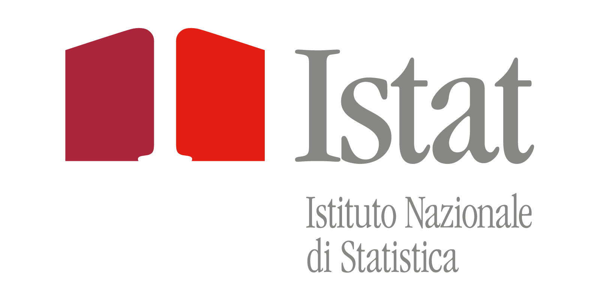

### Analisi del Grado di Accordo con alcuni Stereotipi di Genere sui Ruoli Tradizionali in Italia (2018) per Sesso e Titolo di Studio

---

#### 1. Executive Summary:

Il progetto richiede al candidato di studiare un dataset *I.Stat* che mostra **il grado di accordo (percentuale) con stereotipi di genere sui ruoli tradizionali** per le persone di 18-75 anni su territorio nazionale (**2018**), suddiviso per **titolo di studio** (`nessun titolo di studio`, `licenza di scuola media`, `diploma di scuola secondaria`, `laurea`) e **sesso** (`maschi` e `femmine`). Lo studio serve per misurare: *“Se e quanto varia il grado di accordo con stereotipi di genere sui ruoli tradizionali in funzione di sesso e titolo di studio, e, soprattutto, se il titolo di studio contribuisce a moderare tali differenze”*. Il candidato è chiamato a quantificare le disparità tra uomini e donne, nonché l'impatto moderatore del titolo di studio su queste divergenze, per ricercare la presenza di pattern discriminanti.

---

#### 2. Obiettivi del Progetto:

- Misurare le variazioni del grado di accordo (percentuale) con stereotipi di genere sui ruoli tradizionali tra uomini e donne in relazione al titolo di studio.
- Studiare l’effetto moderatore del titolo di studio su queste divergenze.

Il progetto si inserisce in una strategia di analisi sociale, economica e culturale, per ricercare la presenza di pattern discriminanti attraverso evidenze statistiche.

---

#### 3. Domande di Ricerca:

- Variazione del grado di accordo (percentuale): *Quanto varia il grado di accordo con stereotipi di genere sui ruoli tradizionali in funzione di sesso e titolo di studio?*
- Effetto del titolo di studio: *Il titolo di studio modera la divergenza tra i gruppi?*

---

#### 4. Metodologia:

- Calcolare la **media** del grado di accordo con stereotipi di genere sui ruoli tradizionali per ciascun gruppo (per sesso e titolo di studio), con la formula:

  $$\mu = \frac{1}{n} \sum_{i=1}^{n} x_i$$

  dove:
  - $\mu$ è la media,
  - $n$ è il numero di osservazioni,
  - $x_i$ è il valore $i$-esimo dell'insieme.

- Calcolare la **deviazione standard** per ciascun gruppo, per misurare la dispersione dei dati rispetto alla media, con la formula:

  $$\sigma = \sqrt{\frac{1}{n} \sum_{i=1}^{n} (x_i - \mu)^2}$$

  dove:
  - $\sigma$ è la deviazione standard,
  - $n$ è il numero di osservazioni,
  - $x_i$ è il valore $i$-esimo dell'insieme,
  - $\mu$ è la media dell'insieme.

---

#### 5. Risultati Attesi:

- La variazione del grado di accordo con stereotipi di genere sui ruoli tradizionali per ciascun gruppo (per sesso e titolo di studio).
- La visualizzazione delle divergenze attraverso grafici e tabelle.
- L’interpretazione delle disparità e il contributo del titolo di studio nella moderazione di queste divergenze.

---

### Guida al Progetto:

1. **Preparazione dei Dati**: Importa il dataset in OpenOffice Calc.
2. **Analisi Descrittiva**: Calcola le medie e le deviazioni standard per il grado di accordo con stereotipi di genere sui ruoli tradizionali in funzione di sesso e titolo di studio.
3. **Visualizzazione dei Dati**: Crea grafici a barre o a torta per visualizzare le differenze tra i gruppi.
4. **Esplorazione dei Risultati**: Confronta i risultati per identificare eventuali differenze significative tra i gruppi.
5. **Interpreta i Risultati**: Interpreta i grafici e i dati per rispondere alle domande di ricerca.
6. **Redazione del Report**: Scrivi un report per presentare le operazioni, i risultati e le conclusioni del progetto.
